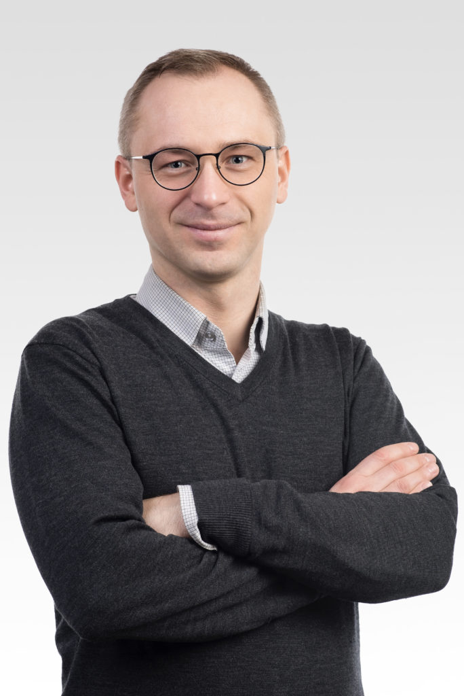

  

# **Tomasz Kacprzak's homepage**
-----------------------------
  

 

 

 
I am a senior scientist at [ETH Zurich](https://www.cosmology.ethz.ch) and a Senior Data Scientist at the [Swiss Data Science Center](https://www.datascience.ch) at the [Paul Scherrer Institute (PSI)](https://www.psi.ch). I obtained my PhD in Physics and Astronomy from the Univeristy College London, as well as previously a MSc in Machine Learning from the same university.

My focus is testing cosmological models using novel statistical and artificial intelligence techniques and applications of machine learning in applied physics and climate modelling.

   *   [List of papers on arxiv.](https://arxiv.org/find/astro-ph/1/au:+Kacprzak_T/0/1/0/all/0/1)
   *   [Library of papers on deep learning in cosmology.](https://ui.adsabs.harvard.edu//#user/libraries/Tm731Ip0TkqWf9jLr5bMpA)

 

## Projects
-----------------------------

### Cosmology and Artificial Intelligence
  

 
Artificial Intelligence methods, such as deep convolutional neural networks, have the capacity to model the complex patterns contained in the cosmic web.
I have introduced the deep learning appraches to constraining cosmological parameters and generating large scale structure simulations.
 * I am the Simulations Working Group coordinator in the [Dark Energy Survey](https://www.darkenergysurvey.org).
 * I am the PI of the production project "Measuring Dark Energy with Deep Learning" at the Swiss Supercomputing Center (CSCS), producing the CosmoGrid simulations, available at [cosmogrid.ai](www.cosmogrid.ai).
 * I was the PI of the ["Deep Learning for Observational Cosmology"](https://datascience.ch/project/deep-learning-for-observational-cosmology-dloc/) programme at the Swiss Data Science Center (SDSC).
 * I was the lead organizer for the workshop ["Artificial Intelligence Methods in Cosmology"](https://sites.google.com/site/aicosmo2019/), held in Monte Verita, Ascona, 9-12 June 2019.

  
### Neutron Diffaction Inverse Problems

 
I am the SDSC lead of the collaborative project "Robust and scalable Machine Learning algorithms for Laue 3-Dimensional Neutron Diffraction Tomography" at the PSI. I am collaborating with the beamline scientists on developing novel methods to dramatially accelerate the polycrystalline grain indexing process from neutron diffraction images and improve the indexing precision. Neutron diffraction uses a wide wavelength beam, which the inversion process is particularly difficult due to its combinatorial nature.

### Climate simulations compression

 
I am the lead data scientist at SDSC's contribution to the [Exclaim](https://exclaim.ethz.ch/) project. I am developing fast and versatile methods for compressing massive climate simulations, aiming at 1km resolution maps produced by the upcoming Alps supercomputing cluster at CSCS. I am investigating possible applications of machine learning techniques to aid the efficiency and accuracy of climate simulations.

  
### Forward modelling of telescope images

 
I have worked on building end-to-end simulations of various telescope images, using parametric models for galaxy populations.
I have pioneered the use of Approximate Bayesian Computation (ABC) techniques to constrain galaxy population models with simulations.
I worked on DES, CFHT and Subaru results, as well as statistical and computational techniques enabling the practical use of this approach.

  
### Weak gravitational lensing analysis

 
The full cosmological lensing analysis is complex: starting from understanding the effects affecting the pixels in the telescope camera, through modelling of atmospheric image distortions, measuring shapes of galaxies, and simulation-driven systematic errors control. Finally, I am exploring novel methods of extracting information from weak gravitational lensing datasets with Convolutional Neural Networks.
I am involved in the Dark Energy Survey project, which is currently observing the southern sky to create the largest galaxy survey to date: [www.darkenergysurvey.org](www.darkenergysurvey.org).

 

## New projects
-------------------------------------

 
If you are a masters student in cosmology, computer science or statistics, and are interested in a project, you send me an email at tomaszk at phys dot ethz dot ch.

 

<!--   Hi! this is just a sample **intro text**. You would normally put your [full name](about/) here and say something *smart* about yourself. -->

<!--  This could also be the good place to say were you are coming from, what you [do for a living](work/) and maybe what you are [interested in](projects/). You might also be [writing](articles/) about stuff. -->

<!--  But after all this is your site and I'm just a **placeholder text** so what would i know about some *home page content*. -->

